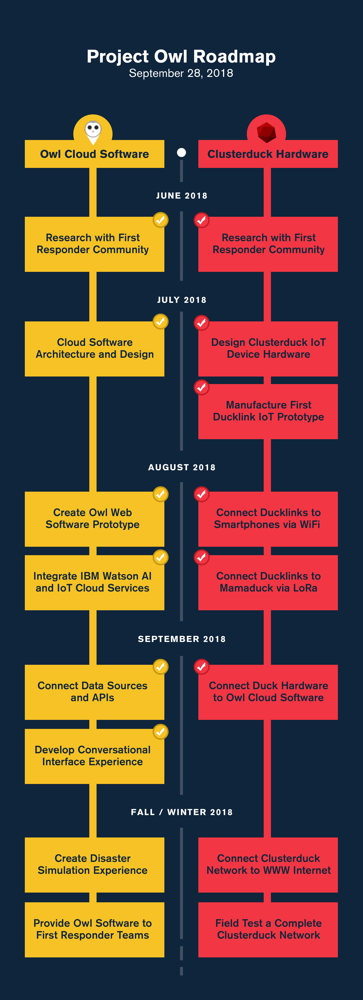

# SMS eschool-Tanzania

  

The eschool plateform is a revolutionary new way to how education is delivered in Tanzania. With over 25+ million user with cell phones that do not have internet capability this plateform extends the capabilities of such devices. Giving students the ability to have all their textbook, and assignment resources available from SMS texts. Also facilitating the ability to search online for additional resources, and providing an avenue to submit assignments. 

*Read this in other languages: [English](README.md), [한국어](README.ko.md), [português](README.pt_br.md).*

## Contents

1. [Short description](#short-description)
1. [Demo video](#demo-video)
1. [The architecture](#the-architecture)
1. [Long description](#long-description)
1. [Project roadmap](#project-roadmap)
1. [Built with](#built-with)
1. [Contributing](#contributing)
1. [Versioning](#versioning)
1. [Authors](#authors)
1. [License](#license)
1. [Acknowledgments](#acknowledgments)

## Short description
The eschool-Tanzania plateform is designed to facilitate access to learning resources from an SMS text based system. Students are able to access assignment information, textbooks, online resources, and submit assignments all from SMS text. 

### What's the problem?

With the COVID-19 pandemic students in Tanzania are not able to go to school as mandanted by the government. Most students do not have access to smartphones with internet capability, satellite televisions, and radios. All online based educational plateform are catered more towards the higher education levels in Tanzania, primarily university. There are no available internet or online based learning plateforms for students in secondary school levels(high school) middle school levels, and primary school levels.

### How can technology help?

Technology can be an asset for providing a very interesting and powerful brigde for facilitating different objectives.

### The idea
The idea is to use short message services(SMS) and increase its capabilities exponentially. This system will give students the ability to have access to all learning resources including textbooks, online resources, translation services, and teachers in real time. Students are able to access information by texting a designated string to an allocated number to get assingments, textbook resources,syllabus information and to submit assignments. Teachers are then able to access the students information in real time from anywhere in the country. This will give teachers a more convenient way of grading students assignments that is more efficient then going through stacks of papers. The design is catered towards public schools where most students and families have cell phones that do not have internet capability... we refer to them here as "feature phones". It's imperative that learning and creating can continue when educational institutions have to shift the way they teach in times of crises, such as the COVID-19 pandemic. Providing a set of open source tools, backed by IBM Cloud and IBM translator, will enable educators to more easily make content available for their students. 

## Demo video

## The architecture

1.) Teachers would text to a set of databases which contain the students grade level and name. For 7th grade it would be <darasa 7 + ',' + <assignment text>
2. The student from the designated grade level would receive the text message and have instructions on how to get information about an assignment, textbook resources, translation services, and online resources. The student would text <ASSN> to designated number for assignments, <subject designation> ex physics 1 for physics resources, <TES + ',' translation text> to get translation, <T + ',' <search text> to get access a search engine for online resources and <WIKI + ',' <wikipedia search text> to get information from the wikipedia webite. 
3. The information would then be collected and the appropriate functions will be called based the the string format
4. The inforamtion would then be sent back to the user
5. All the information for assignments, and textbook resources are stored on SQL database and accessed and returned to student when appropriate string is sent to python logic system. 

## Long description

[More detail is available here](DESCRIPTION.md)

## Project roadmap

## Built with

* [IBM Watson Language Translator](https://www.ibm.com/watson/services/language-translator/) - 
* [IBM Cloud Functions](https://cloud.ibm.com/catalog?search=cloud%20functions#search_results) - The compute platform for handing logic
* [IBM API Connect](https://cloud.ibm.com/catalog?search=api%20connect#search_results) - The web framework used

## Contributing

Please read [CONTRIBUTING.md](CONTRIBUTING.md) for details on our code of conduct, and the process for submitting pull requests to us.

## Versioning

We use [SemVer](http://semver.org/) for versioning. For the versions available, see the [tags on this repository](https://github.com/your/project/tags).

## Authors

* **Billie Thompson** - *Initial work* - [PurpleBooth](https://github.com/PurpleBooth)

See also the list of [contributors](https://github.com/Code-and-Response/Project-Sample/graphs/contributors) who participated in this project.

## License

This project is licensed under the Apache 2 License - see the [LICENSE](LICENSE) file for details

## Acknowledgments

* Based on [Billie Thompson's README template](https://gist.github.com/PurpleBooth/109311bb0361f32d87a2).
